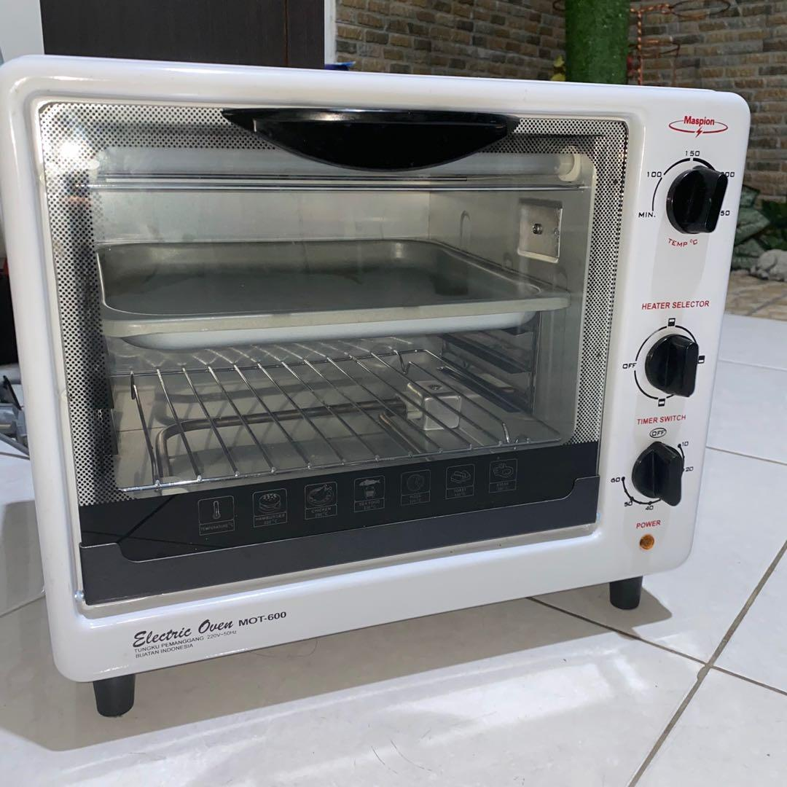
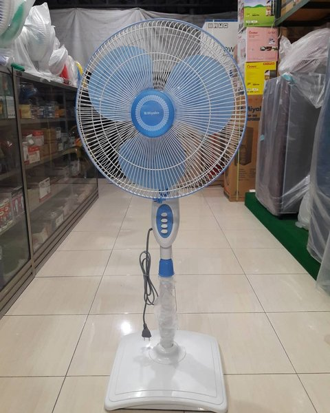
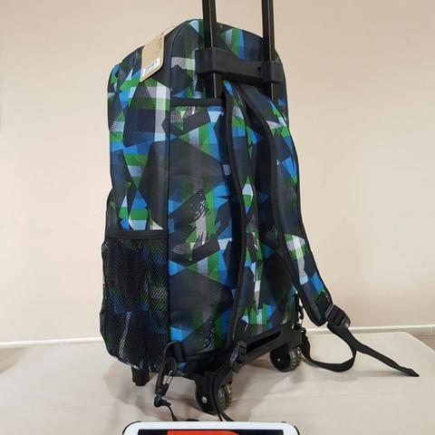
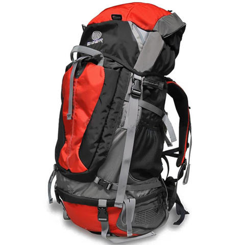
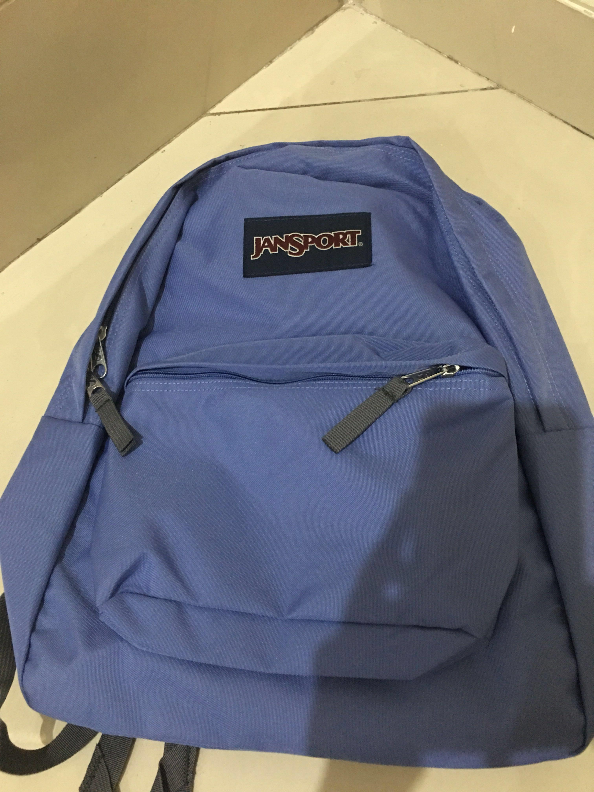

# LAPORAN PRAKTIKUM JOBSHEET 1

Oleh : MILA YUNITA (TI-2C/12)

## Pertanyaan Percobaan Jobsheet 1

1. Jelaskan perbedaan antara objek dengan class! 

    Jawab:Perbedaan objek dengan class yaitu, objek merupakan hasil perwujudan dari sebuah class, bersifat spesifik. Sedangkan class merupakan blueprint atau template atau design yang digunakan untuk membuat suatu objek, bersifat umum (masih rancangan).

2.  Jelaskan alasan warna dan tipe mesin dapat menjadi atribut dari objek mobil! 

     Jawab: Alasan warna dan tipe mesin dapat menjadi atribut dari objek mobil karena maksud dari atribut itu sendiri adalah data yang dimiliki oleh suatu objek atau class yang mana dalam hal ini warna dan tipe merupakan data yang melekat pada objek mobil. Sehingga warna dan tipe mesin dapat dijadikan sebagai atribut objek mobil

3. Sebutkan salah satu kelebihan utama dari pemrograman berorientasi objek dibandingkan dengan pemrograman struktural! 

	 Jawab:Salah satu kelebihan utama dari pemrograman berorientasi objek dibandingkan dengan pemrograman stuktural adalah pada pemrograman berorientasi objek, apabila terjadi perubahan fitur  maka hal tersebut tidak akan mengganggu keseluruhan program yang telah dibuat. Berbeda dengan pemograman struktural, yang mana apabila terjadi perubahan fitur maka hal tersebut kemungkinan dapat mengganggu keseluruhan program.

4. Apakah diperbolehkan melakukan pendefinisian dua buah atribut dalam satu baris kode seperti “public String nama,alamat;”? 
	
    Jawab:Pendefinisian dua atribut dalam satu baris kode diperbolehkan. Apalagi jika ingin dibuat beberapa atribut yang memiliki tipe data yang sama, maka cara pendefinisian seperti pada soal tersebut dapat dilakukan untuk menghemat kode program.

5. Pada class SepedaGunung, jelaskan alasan atribut merk, kecepatan, dan gear tidak lagi ditulis di dalam class tersebut!

	Jawab:Alasan atribut merk, kecepatan, dan gear tidak ditulis ulang di dalam class SepedaGunung karena dalam class SepedaGunung telah ditambahkan kode program “extends Sepeda”. Hal itu menunjukkan bahwa class sepedaGunung telah mewarisi atribut dan method yang ada di class Sepeda. Sehingga pembuatan class sepedaGunung tidak perlu membuat dari nol lagi dan dapat langsung menambahkan fitur yang ingin ditambahkan yang sebelumnya belum ada di dalam class Sepeda.

## TUGAS PRAKTIKUM 1

  Hasil dari identifikasi benda-benda di sekitar saya, ditemukan beberapa benda yang sesuai untuk dilaporkan dalam tugas praktikum ini. Benda yang dimaksud antara lain: 

1. Oven Listrik
  
  Berdasarkan hasil pengamatan yang saya lakukan, atribut dan method dari objek Oven Listrik yakni:

   a. Atribut dari objek Oven Listrik antara lain: merk, suhu, dan rak panggangan.

   b. Method dari objek Oven Listrik antara lain: setMerk(), setRakPanggangan(), tambahSuhu(), kurangSuhu(), dan cetakInformasi().

2. Kipas Angin

Berdasarkan hasil pengamatan yang saya lakukan, atribut dan method dari objek Kipas Angin yakni:

   a. Atribut dari objek Kipas Angin antara lain: merk, warna, dan kecepatan putar.

   b. Method dari objek Kipas Angin antara lain: setMerk(), setWarna(), tambahKecepatan(), kurangiKecepatan(), dan cetakInformasi().

3. Tas Troli

Berdasarkan hasil pengamatan yang saya lakukan, objek Tas Troli mewarisi atribut dan method yang dimiliki objek Tas. Hanya saja terdapat beberapa suspensi tambahan seperti:

    1. Atribut: perlengkapan troli/suspensi tambahan, dan kecepatan tarik troli.

    2. Method: tambahKecepatanTarik(), kurangiKecepatanTarik(), dan cetakStatus().
      

4. Tas Gunung

Berdasarkan hasil pengamatan yang saya lakukan, objek Tas Gunung mewarisi atribut dan method yang dimiliki objek Tas. Hanya saja terdapat beberapa suspensi tambahan seperti:
   
    1. Atribut: HipBelt, topLid, dan hipBelt pocket.
      
    2. Method: PasangTopLid(), tambahBarangHipBeltPocket(), kurangiBarangHipBeltPocket(), dan cetakStatus().

Objek Tas

   

Adapun atribut dan method dari objek Tas yang dimaksud yakni:

  a. Atribut: merk, jenis bahan, resleting, kantong, dan beban muat.

  b. Method: setMerk(), setJenisBahan(), setResleting(), setKantong(), tambahBeban(), kurangBeban(), dan cetakInformasi.